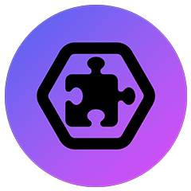

  <h3 align="center"> 
  <a href="https://twitch.tv/skate702">🎉 Coming soon...</a></h3>

&nbsp;

## stubits - Simple to Use Broadcast Interaction Tiles
*Like stupid, stupid!*

> [!CAUTION]  
> The current state of this project is just a combination of legacy code sticked together from [nodecg-io](https://github.com/codeoverflow-org/nodecg-io) and [skate's bundles](https://github.com/sebinside/skates-bundles). It suffers from *very* bad code quality and is subject to a larger refactoring.