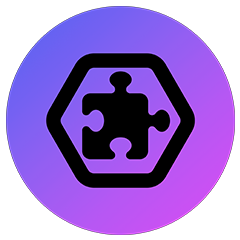

  <h3 align="center"> 
  <a href="https://twitch.tv/skate702">🎉 Coming soon...</a></h3>

&nbsp;

## stubits - Simple to Use Broadcast Interaction Tiles
*Like stupid, stupid!*

This branch holds the complete rewrite of **stubits**, hopefully representing the foundation for all future stream-related stuff (any I have many ideas).

### Tasks

The following lists gives you (and, most of all, me!) a rough idea how to achieve a rewritten version ready to be used in production (aka my own livestream):

* [ ] Rewrite and test basic core functionality
  * [x] Add basic structure with core, services, tiles
  * [x] Add two major phases: setup vs. run
  * [x] Add simple service and tile base classes
  * [x] Implement core logging system using chalk
  * [x] Implement core configuration and encrypted credentials storage based on LowDB
  * [x] Implement core communication layer (HTTP + WebSocket)
  * [x] Write basic database unit tests
  * [ ] Write basic communication unit tests
  * [ ] Write basic logger unit tests
* [ ] Add initial UI
  * [ ] Write HTTP or WS endpoints to access basic functionality like getting status, list services, add/remove/list credentials and configs
  * [ ] Move existing UI code out of the way
  * [ ] Create a template for future UI stuff, choose between react and vue
  * [ ] Create simple web interface to access these endpoints
* Add/Rewrite services with better error handling (old terminology: providers)
  * [ ] Spotify
  * [ ] SQL
  * [ ] StreamElements
  * [ ] TwitchChat, TwitchEvent, TwitchAuth
  * [ ] Make TwitchEvent nice (enabling/disabling user actions, ...)
  * [ ] Have a look at the testability of these services
* Add/Rewrite tiles with new UI (old terminology: services)
  * [ ] StreamInfo
  * [ ] StreamBar
  * [ ] StreamTodo
  * [ ] SubServiceArchive
  * [ ] Have a look at the testability of these tiles
* Finalize rewrite 
  * [ ] Enhance documentation
  * [ ] Test the new implementation in stream and fix bugs
  * [ ] Add nx to manage all parts (e.g., client, server, tiles, ...)
  * [ ] Add dev container and docker
